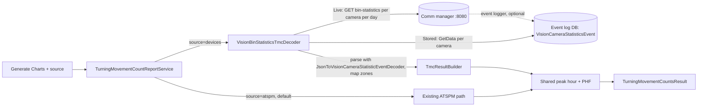

> Implementation update (September 28): source discovery and camera-only chart availability use existing device data/Config API endpoints. Config API and device editor remain unchanged. The implementation guide supersedes older Live/Stored-mode examples below.

# TMC from Device Sources — Design

Sep 25, 2026 · Derek Lowe · Living version: https://claude.ai/code/artifact/d17291df-317d-4fe8-a1fa-2afac46652e7

## Summary and goals

The Turning Movement Counts (TMC) page gets a **Count source** radio group. It lists ATSPM (the controller event log, today's behavior) plus each group of camera devices whose device properties name a TMC decoder. The first decoder, `VisionBinStatisticsTmcDecoder`, works from **Econolite Vision bin statistics** in either of two modes:

- **Live:** calls the camera's `bin-statistics` API at report time (unprocessed data, the v1 requirement).
- **Stored:** reads `VisionCameraStatisticsEvent` rows the event logger saved.

Both modes parse the same JSON shape into the same normalized counts. A shared builder turns those into the existing `TurningMovementCountsResult`.

- **ATSPM is the default and needs nothing:** it keeps today's code path, with no decoder and no property. Controllers need no configuration.
- **One interface for device sources:** Econolite Vision is the first decoder (`VisionBinStatisticsTmcDecoder`), reading bin statistics live from the camera or from the event log. Cameras, radar and LiDAR follow the same pattern.
- **The device property is both the flag and the decoder choice:** `DeviceProperties["TmcDecoder"] = "VisionBinStatisticsTmcDecoder"`. With no property, the device is not a TMC source. This mirrors how `DeviceConfiguration.Decoders` already picks event log decoders by class name.
- **One source per run:** the user picks exactly one, so counts from two sources are never summed or double-counted.
- Every result records which source produced it.

**Out of scope:** editing device zones, per-vehicle detections as a TMC source, and decoders beyond ATSPM and Econolite Vision bin statistics in v1. If the mapping below proves insufficient, a separate camera-counts report would be built on the bin-statistics data as-is.

## Current state

Today TMC is built only from controller event code 82 (detector on) stored in the event log database. It then runs through the detector configuration.

| Layer | Component | What it does |
| --- | --- | --- |
| WebUI | `pages/performance-measures/index.tsx` → `ChartsContainer` | The user picks a location, dates and TMC, then clicks **Generate Charts**; `useCharts` posts to `TypeApiMap[TurningMovementCounts]` |
| WebUI | `turningMovementCounts.transformer.ts`, `TurningMovementCountsTable.tsx` | Turns `TurningMovementCountsResult` into charts and a table |
| ReportApi | `TurningMovementCountsController` → `TurningMovementCountReportService` | Loads the location and 82 events (±12 h) and builds lane results per lane type × direction × movement group. It also computes the table, peak hour and PHF |
| Application | `TurningMovementCountsService.GetChartData` | Bins detector events into `Lane` and `TotalVolumes` series for one direction/movement |
| Data | `Device` → `DeviceConfiguration` → `Product` (`Manufacturer`, `Model`) | Device records per location; `DeviceType` enum has `AICamera` and `FIRCamera` |
| ConfigApi | `GET Device/GetActiveDevicesByLocation(locationId)` | Returns active devices with `DeviceConfiguration.Product` already included |

**Base branch:** work happens on `feature/tmc-device-sources`, cut from `Sync-Gilbert-with-Udot-clean`. That branch already has the Gilbert Vision camera code, which upstream `main` lacks:

- `DeviceController` camera discovery calls `GET http://{ip}:{port}/api/v1/cameras` and `/cameras/{id}/device-info`. It is gated on `DeviceTypes.FIRCamera`.
- `DetectorController` zone lookup calls `GET /api/v1/cameras/{id}/zones`. It maps zone names to `Detector.DectectorIdentifier`.
- `VisionCameraJsonToIndianaEventDecoder` turns camera `detections` (`zoneName`, `time`, `direction` = Through/LeftTurn/RightTurn, `objectType`) into event 82 rows. It matches detectors by zone name and movement.

This design reuses the camera HTTP contracts already on the branch. It deliberately drops the zone-to-detector mapping, so device sources don't depend on ATSPM detector configuration.

**How cameras are addressed today: one call per camera.** One Vision comm manager (one IP and port) hosts several cameras, and ATSPM models each camera as its own `Device`. Those devices share the same `Ipaddress` and `DeviceConfiguration` (port). `DeviceIdentifier` holds the camera index.

| Call | Scope | Where |
| --- | --- | --- |
| `GET /api/v1/cameras` | One call per comm manager: lists every camera and its index | `DeviceController.retrieveDeviceData` (camera discovery) |
| `GET /api/v1/cameras/{index}/device-info` | One call per camera | Same, loops over cameras |
| `GET /api/v1/cameras/{index}/zones` | One call per camera | `DetectorController.retrieveDetectionData`, called once per FIR camera device from `ApproachOptions.tsx` |
| Event log download | One workflow per camera device (at most 3 concurrent); URL rendered per device from `DeviceConfiguration.Path`/`Query` with `[Device:DeviceIdentifier]` and `[StartTime]`/`[EndTime]` tokens | `LoggingController.SyncDeviceEvents`, `DeviceDownloader` |

A four-approach intersection with one camera per approach is therefore four devices. Logging downloads each camera separately and stores its rows under that camera's `DeviceId` (`ArchiveDataEvents`). The design groups a location's cameras into **one source** and reads each camera's bins.

**What is logged today** (checked read-only on the `atspm-clone` Cloud SQL instance, `ATSPM-Config-V6` and `ATSPM-EventLogs-V2`, data through 2026-05-20):

| Finding | Detail |
| --- | --- |
| Camera device configuration | ID 15 `Cameras!`: Econolite "Vision Camera", HTTP port 8080, path `/api/v1/cameras`, 229 devices |
| Bin statistics are downloaded per camera | Query `/[Device:DeviceIdentifier]/bin-statistics?start-time=[StartTime]&end-time[EndTime]` (detections has the same form) |
| Query bug | Both queries have `&end-time[EndTime]`; the `=` is missing |
| Bin statistics are not decoded | Config 15's decoders are only `VisionCameraJsonToIndianaEventDecoder`, `...ToSpeedEventDecoder`, `...ToEnhancedVehicleEventDecoder`. `JsonToVisionCameraStatisticEventDecoder` exists and is auto-registered but isn't listed, so the bin statistics responses are discarded |
| Stored rows | `IndianaEvent` 353,419 blocks, `SpeedEvent` 41,390, `EnhancedEventLog` 431; **0 `VisionCameraStatisticsEvent`** |

So neither the clone nor production stores bin statistics today. Local Docker logging on this branch does store them (see Vision bin-statistics decoder), which proves the Stored path. v1 uses Live mode, so no data has to exist first.

## Source discovery

A device is a TMC source when it is active and its `DeviceProperties` contain a `TmcDecoder` key whose value names a registered decoder class. The property is the opt-in flag and the translator choice in one. The WebUI reads it from device data it already has, or from the ConfigApi when it doesn't.

**The property**

| Key | Value | Example |
| --- | --- | --- |
| `TmcDecoder` | Class name of an `ITurningMovementCountDecoder` implementation | `VisionBinStatisticsTmcDecoder` |

- Admins set it in the existing **Device properties** key/value editor in `NewDeviceModal.tsx`. No schema change or migration is needed, because `DeviceProperties` is already a JSON column.
- Reuse the existing device-properties editor for `TmcDecoder`. No new Config API endpoint or editor autocomplete is required. The supported report decoder keys are `VisionCameraAPI` and `VisionBinStatisticsStored`.
- Optional decoder settings sit beside it with a `Tmc` prefix (`TmcSourceMode`, `TmcLayer`, `TmcApproach`, `TmcZoneMap`; see Vision bin-statistics decoder) and are passed to the decoder untouched.

**ATSPM is always the default source.** It is listed first and selected by default for every location, and it runs the existing controller event log path. It has no decoder and needs no device property, so no controller has to be configured for it.

The Vision decoder also checks that a flagged device is a Vision camera, so a property set on the wrong hardware fails with a clear message. `VisionBinStatisticsTmcDecoder.CanDecode(device)` requires:

1. `d.DeviceStatus == Active`
2. `d.DeviceType` is `FIRCamera` or `AICamera` (existing camera discovery keys on `FIRCamera`)
3. `d.DeviceConfiguration.Product.Manufacturer` equals `Econolite` (case-insensitive)
4. `d.DeviceConfiguration.Product.Model` contains `Vision` (case-insensitive)
5. `d.Ipaddress` is set

In **Stored** mode it also requires `LoggingEnabled = true` and that `DeviceConfiguration.Decoders` contains `JsonToVisionCameraStatisticEventDecoder`. In **Live** mode it requires `Ipaddress` and a port.

**Finding sources in the WebUI**

1. **Page data first:** if `location.devices` is loaded with `deviceProperties`, filter it for active devices that have `TmcDecoder`.
2. **Otherwise, call the ConfigApi:** use the existing generated hook for `GET /Device/GetActiveDevicesByLocation(locationId={id})`, which already returns `DeviceProperties`, then apply the same filter. No new discovery endpoint is needed.

This is wrapped in `useTmcSources(location)`. It returns ATSPM first, then one entry per **device group**: the location's active flagged devices that share a `TmcDecoder`, typically all the Vision cameras at the intersection. For example, `{ key: "devices:42,43,44,45", name: "Econolite Vision (4 cameras)", deviceIds: [42, 43, 44, 45], decoder: "VisionBinStatisticsTmcDecoder" }`. The hook is cached by `location.id` and runs only when TMC is the selected chart.

**Server-side check.** ReportApi resolves the decoder named on the device from DI and runs `CanDecode`. It returns 400 if the name isn't registered or the check fails, so a stale or mistyped property can't reach hardware.

## UI changes

A **Count source** radio group sits in the TMC chart options (`TurningMovementCountsChartOptions.tsx`), under bin size and Combine Thru + Right. **Generate Charts** stays the only run button.

- **Options:** one radio per entry from `useTmcSources(location)`. "Indiana Events (ATSPM)" is always first; each device group shows its name and decoder (for example "Econolite Vision (4 cameras)").
- **Default:** ATSPM. If the location has no device sources, the Count source group is not rendered at all, and TMC looks and runs exactly as it does today.
- **One source per run:** a radio group, where a source is ATSPM or one device group. All cameras in the group run together, so a four-camera intersection produces a complete TMC in one run. Counts from ATSPM and cameras are never mixed.
- **Run flow:** chart options get `source: "atspm" | "devices"` and, for devices, `deviceIds: number[]`. `getCharts` posts to the same `TurningMovementCounts/GetReportData` endpoint, and the transformer, table and filters are unchanged.
- **Source label:** shown only while `Features:TmcDeviceSources` is on. It sits beside the **Table View** heading and on each chart's info line (for example "Source: Vision Camera API (4 cameras)"), and CSV export adds a `Source` column. When some cameras didn't respond, it reads "Vision Camera API (3 of 4 cameras)". With the flag off, none of the three appear.
- **Missing-day marks:** the calendar's X marks come from ATSPM controller events, so they're hidden while a device source is selected.
- **Errors and warnings:** shown below the Generate Charts button and the chart toolbox, with space between. A report that fails lists one line per camera.
- **URL state:** `source` is included in the shareable query string. If the device no longer qualifies, the page falls back to ATSPM.

The only admin UI change is the `TmcDecoder` value suggestions in the device properties editor.

## Backend design

ATSPM runs today's code path unchanged. Device sources are `ITurningMovementCountDecoder` implementations that return normalized movement counts, and `TmcResultBuilder` turns those counts into `TurningMovementCountsResult`. The peak-hour, PHF and peak-hour-volume methods are extracted from `TurningMovementCountReportService` into a shared helper, so both paths compute them identically.



**The contract** (Application project, so it has no infrastructure dependencies):

```csharp
public interface ITurningMovementCountDecoder
{
    int MinimumBinMinutes { get; }        // 1 for per-vehicle data, 15 for pre-binned devices
    bool CanDecode(Device device);        // e.g. Econolite product check
    Task<TmcDecodeResult> DecodeAsync(TmcDecodeRequest request, CancellationToken cancellationToken);
}

public record TmcDecodeRequest(
    Location Location,
    Device Device,
    IReadOnlyDictionary<string, object> Settings,   // the device's Tmc* properties
    TurningMovementCountsOptions Options);

public record MovementCount(
    DirectionTypes Direction,
    MovementTypes Movement,               // L, T, R, TL, TR
    LaneTypes LaneType,                   // Vehicle, Bike, Ped
    int? LaneNumber,
    DateTime BinStart,                    // location local time
    int BinMinutes,
    int Volume);

public record TmcDecodeResult(
    IReadOnlyList<MovementCount> Counts,
    IReadOnlyList<string> Warnings);
```

The contract is counts, not raw events. In Live mode the camera bins to exactly `options.BinSize` (`MinimumBinMinutes` = 1). In Stored mode bins are 15 minutes (`MinimumBinMinutes` = 15) and the builder rolls up to larger sizes.

**Registration and lookup.** `services.AddTmcDecoder<VisionBinStatisticsTmcDecoder>()` registers each decoder as a keyed service under its class name.

- **For `source=devices`:** ReportApi checks that every requested device is active, shares the same `TmcDecoder`, and belongs to the requested location. It resolves `GetRequiredKeyedService<ITurningMovementCountDecoder>(tmcDecoder)` once, then calls `DecodeAsync` once per device in parallel. That is a live HTTP call or a database read, per the device's `TmcSourceMode`, with at most 4 concurrent per comm manager. It concatenates the counts, which cover different approaches, before `TmcResultBuilder`.
- **For `source=atspm`,** the default, it skips decoder lookup entirely.
- Registration is internal to ReportApi; source discovery uses existing Config API device data.

**Components**

| Component | Project | Responsibility |
| --- | --- | --- |
| `ITurningMovementCountDecoder`, `TmcDecodeRequest`, `MovementCount`, `TmcDecodeResult` | Application | The contract above |
| `TmcResultBuilder` | Application | Rebins to `options.BinSize`, applies Combine Thru + Right, and builds `TurningMovementCountsLanesResult` per direction × movement × lane type. Then builds the table, peak hour, PHF and lane utilization. Peak hour and PHF come from the shared helper |
| `VisionBinStatisticsTmcDecoder` | Infrastructure | Live: calls `bin-statistics` per camera per day with `interval` = BinSize. Stored: reads `VisionCameraStatisticsEvent`. Both parse with `JsonToVisionCameraStatisticEventDecoder` and resolve zones by naming convention |
| `AddTmcDecoder<T>()` | Infrastructure | Keyed DI registration in `ServiceExtensions`; the only line needed for a new decoder |
| `TurningMovementCountReportService` | ReportApi | Resolves the decoder for `options.Source`, validates it, calls `DecodeAsync`, then `TmcResultBuilder` |

**Options and result.** Add `string Source` to `TurningMovementCountsOptions`, defaulting to `"atspm"`, so existing callers are unchanged. Add `string Source` and `IReadOnlyList<string> Warnings` to `TurningMovementCountsResult`. Regenerate `report-spec.json` and the orval client.

**Validation.** 400 if the device has no `TmcDecoder`, the name isn't registered, `CanDecode` fails, or `options.BinSize` isn't a multiple of the decoder's `MinimumBinMinutes`.

**Plans.** Plan bands still come from ATSPM event 131 for the window, whatever the source. If there are none, the result has a single "Unknown" plan.

**Config reads at report time.** For `source=devices`, ReportApi reads the requested devices: that they are cameras at the location, plus their IP, port, index and `Tmc*` properties. Zone-to-approach mapping needs no config when names follow Gilbert's convention.

## Vision bin-statistics decoder

`VisionBinStatisticsTmcDecoder` gets bin statistics for each camera in the group, either live or stored, and maps them to `MovementCount` rows. The mode is a device property, so each agency (or each device) chooses.

| Mode | Where the bins come from | Config needed at report time | Status |
| --- | --- | --- | --- |
| **Live** (v1 default) | `GET http://{Ipaddress}:{Port}/api/v1/cameras/{index}/bin-statistics?start-time=..&end-time=..&interval={BinSize}` | Device IP, port and camera index | Verified against `10.10.10.26:8080` |
| **Stored** | `IEventLogRepository.GetData<VisionCameraStatisticsEvent>(locationIdentifier, start, end, deviceId)` | None beyond the location | Working in local Docker logging; not enabled in the clone or production |

Both modes produce `VisionCameraStatisticsEvent` objects. Live mode parses the HTTP response with the existing `JsonToVisionCameraStatisticEventDecoder`, so there is one JSON model and one mapper.

**Camera API behavior** (tested on camera 1 "AveTest", firmware 3.9.0.55, over the office LAN and the maintenance port with identical results)

| Behavior | Finding | Decoder rule |
| --- | --- | --- |
| Endpoint | Per camera only; by index (`/cameras/1/...`) or device ID (`/cameras/523648495/...`). No all-cameras endpoint found (`/bin-statistics`, `/cameras/bin-statistics` return 404) | One call per camera; indexes come from `DeviceIdentifier` or `GET /api/v1/cameras` |
| Date format | Zero-padded ISO 8601 required; `2026-9-4T18:37:05` returns 400 | Always format `yyyy-MM-ddTHH:mm:ssZ` |
| Time zone | Input without offset is UTC; offsets are honored; output `time` is always UTC (`Z`) | Send UTC, convert output to location local time |
| `interval` | Bin size in minutes, default 15; tested 1, 5, 15, 60 and 1440, with identical totals at every size | Pass `options.BinSize`; `MinimumBinMinutes` = 1 |
| Alignment | Bins are anchored to `start-time` (a `00:00` start gives :00/:15/:30/:45) | Floor `Start` to the bin boundary before calling |
| Bin label | `time` is the bin **start**: detections at 15:05 fall in the 15:00 bin, and a 15:00–15:15 window returns exactly the 15:00 bin. Windows are start-inclusive and end-exclusive | `BinStart = time` |
| Empty bins | Bins with zero volume are omitted | Fill missing bins with 0 |
| `end-time` | Optional; missing or malformed returns everything to now | Always send it |
| Large ranges | Multi-month responses came back truncated (invalid JSON at about 92 KB) | Request one day at a time per camera |
| History | Back to 2025-07-05 on the test unit | Live mode covers any date the camera retains |

**Econolite's API reference.** *Autoscope Vision 3.0 API Programmers Guide* (rev D, 05/2021) documents `GET (prefix)cameras/s/bin-statistics?start-time=xx&[end-time=yy]&[interval=zz]` and confirms the behavior above:

- `time` is the **bin start time**.
- All response timestamps are GMT (`Z`).
- A record on the exact `end-time` is excluded.
- `interval` is in minutes, defaults to 15, and must be no larger than end minus start.
- `leftToRightCount` / `rightToLeftCount` are **pedestrian movements**.

It also adds four points the design follows:

| From the guide | Design impact |
| --- | --- |
| `s` is the sensor number **1–4** or the sensor's device ID; default port 80 | Up to 4 cameras per comm manager; use the device's configured port (Gilbert: 8080) |
| Optional authentication: if enabled on the comm manager (Supervisor, Device Settings), requests need a user name and password | Live mode sends HTTP Basic credentials from `DeviceConfiguration.UserName`/`Password` when set; 401 becomes a warning naming the camera |
| `averageSpeed` is **km/h** | Not used by TMC. Note that the existing detection decoders treat `speed` as mph (`VisionCameraJsonToEnhancedVehicleEventDecoder` sets `Mph = speed`) |
| Its own example shows a zone named "Through 1" with `rightTurnCount` 11 | Confirms that zone type is not movement; movement comes from the counts |

`detection-config` (zone polygons, rules and output channels, used by Supervisor) is **not** in the guide. The design doesn't depend on it; it's only useful for diagnostics.

**Stored mode**, as seen in local Docker logging: the bin statistics are logged by a separate device (`523648495-bins`). Its configuration has only `JsonToVisionCameraStatisticEventDecoder` and the query `?start-time=[BinStartTime]&end-time=[BinEndTime]`.

- The new `[BinStartTime]`/`[BinEndTime]` tokens request the last full hour, ending on a 15-minute boundary. They are uncommitted changes on this branch, to `DeviceDownloader`, `HttpDownloaderClient` and the decoder.
- The decoder now stores local time (`17:15Z` stored as `10:15`), using the container's time zone.
- Stored bins are at the camera's default 15 minutes, so in Stored mode `MinimumBinMinutes` = 15.

**What each bin carries**

| Needed for TMC | In the bin? | Source |
| --- | --- | --- |
| Movement (T / L / R) | Yes | `throughCount`, `leftTurnCount`, `rightTurnCount`; `volume` = their sum in every sampled row |
| Zone | Yes | `zoneId`, `zoneName` |
| Approach | By naming convention | `zoneName` code: through letter or phase digit (see Gilbert's zone naming convention) |
| Lane | By naming convention or `TmcZoneMap` | Not parsed; each zone is its own lane series, labeled by zone name |
| Vehicle class | No | Bins are vehicle totals |
| Pedestrian crossings | Yes, in P (pedestrian) zones | `leftToRightCount` / `rightToLeftCount`; non-zero only in historical zone `P2-64` |
| Speed, occupancy, phase counts | Yes, unused by TMC | `averageSpeed`, `occupancy`, `phaseNumber`, `red/yellow/green/fyaPhaseCount` |

**Gilbert's zone naming convention**

This comes from Gilbert's detection layout templates:

- *Detection Layout Default.xlsx* (Default, 10/8/2024)
- *O420 Fiesta & Guadalupe* (8/7/2024)
- *Loop202_Default* (10/8/2024)

A camera zone is named `{code}-{channel}`, where `code` is the layout code and `channel` is the detector channel. The historical zones on the test unit match the O420 layout exactly: `N21-1`, `S61-33`, `W82-50`, `L31-54`, `A221-10`, `A621-42`, `P2-64`. (`NB-18` and `SB-36` are test names.)

| Code | Example | Meaning | Detection layer | Direction from | Lane type |
| --- | --- | --- | --- | --- | --- |
| `N`/`S`/`E`/`W` + phase + lane | `N21`, `S63`, `E42`, `W81` | Through lane | Stop bar | Letter | Vehicle |
| `L` + phase + lane | `L51`, `L12` | Left-turn lane | Stop bar | Phase | Vehicle |
| `R` + phase | `R2` | Right-turn lane | Stop bar | Phase | Vehicle |
| `B` + phase | `B2` | Bike zone | Stop bar | Phase | Bike |
| `P` + phase | `P2`, `P4` | Pedestrian zone (confirmed by Gilbert) | Crosswalk | Phase | Ped |
| `RR` + phase + lane | `RR21`, `RR5` | Red-light running, past the stop bar (confirmed by Gilbert) | Red-light running | Phase | Vehicle |
| `A` + phase + setback + lane | `A231` | Advance detector upstream | Advance (setback 2, 3, …) | Phase | Vehicle |
| `NE`, `SE`, `WE`, `EE` | — | Unknown corner codes | — | — | Ignored |

**Only the approach and the lane type are taken from the zone name.** The zone type (`N`, `L`, `R`) and the lane digit are **not** used to decide movement. Movement always comes from the zone's own `throughCount`, `leftTurnCount` and `rightTurnCount`, so a single zone that sees left, through and right traffic splits correctly.

**Phase to direction.** Gilbert's standard is phase 2 = NB (left 5), 4 = EB (left 7), 6 = SB (left 1), 8 = WB (left 3). It isn't universal: Loop 202 has 02 SB and 06 NB. The layouts put this in the **camera names** (`O420 02 NB 05 LT` = through phase 2, Northbound, left phase 5). So the decoder resolves direction in this order:

1. `TmcZoneMap[zoneName]` device property, if present.
2. The through-lane letter (`N`/`S`/`E`/`W`) for through zones.
3. For `L`, `R`, `B` and `P` zones, the phase digit, looked up in a phase-to-direction map built from the camera names at the location (`/api/v1/cameras/{i}/device-info` `name`, or the ATSPM device name). The map falls back to Gilbert's standard 2/4/6/8.
4. Otherwise the zone is unmapped and listed in a warning.

**One detection layer: stop bar by default.** A vehicle can cross an advance zone, then a stop-bar zone, then a red-light running zone, so layers are never added together. The decoder counts **only stop-bar zones** (`N/S/E/W`, `L`, `R`, `B`) plus `P` zones for pedestrians. Advance (`A`) and red-light running (`RR`) zones are ignored and listed in the result's warnings with their volume.

A location can opt into a different layer with the camera device property `TmcLayer` (`StopBar` default | `RedLightRunning` | `Advance`). This is for sites that only have those zones. `Advance` uses a single setback, the one closest to the stop bar, never several. There is no automatic fallback, so a missing stop-bar zone shows up as a missing approach rather than silently switching layers.

**Exceptions.** Interchange layouts like Loop 202 add codes the standard doesn't cover: `NA1`, `N61` (a Northbound lane on phase 6), `NGL1`, `SB1`, `S2L1`, overlap zones `O11`/`O21` and `BA`/`BB`. Those locations need `TmcZoneMap`.

| Optional property (camera device) | Value | Use |
| --- | --- | --- |
| `TmcSourceMode` | `Live` (default) \| `Stored` | Where bins come from |
| `TmcLayer` | `StopBar` (default) \| `RedLightRunning` \| `Advance` | Which detection layer is counted |
| `TmcApproach` | `Northbound` \| `Southbound` \| … | Fallback approach for the camera's zones |
| `TmcZoneMap` | JSON: `{ "NB-18": { "approach": "Northbound", "lane": 1 } }` | Explicit per-zone approach and lane |

**Lanes.** The lane digit isn't parsed. Each zone in the chosen layer that has a count for a movement becomes one lane series for that movement, labeled with its zone name (see Zone names on the chart). `LaneNumber` is only an ordinal for sorting.

**Translation**

| Bin field | Maps to | Rule |
| --- | --- | --- |
| `zoneName` | Direction, LaneType, detection layer | Code table above; only zones in the chosen layer are kept |
| `throughCount` | `MovementCount`, Movement T | Every kept vehicle or bike zone |
| `leftTurnCount` | `MovementCount`, Movement L | Every kept vehicle or bike zone |
| `rightTurnCount` | `MovementCount`, Movement R | Every kept vehicle or bike zone |
| `leftToRightCount` + `rightToLeftCount` | `MovementCount`, LaneType Ped | `P` zones only |
| `volume` | — | Not used (it equals T + L + R) |
| `time` | `BinStart` | Bin start, converted from UTC to location local time |
| `interval` (live) / 15 (stored) | `BinMinutes` | Requested bin size |

**Missing data** is reported, not hidden: a camera that returns no bins, or can't be reached in Live mode, adds a warning naming the camera.

**Builder impact:** `TmcResultBuilder` takes its directions, movements and lanes from the counts it receives, never from `Location.Approaches`. The location is used only for its identifier, description and time zone.

## Mapping to the current TMC report

Bin statistics fill every field of the current vehicle TMC report, so no separate report is needed for v1. Bike and pedestrian rows come from B and P zones. The only loss is plan bands when the location has no controller data.

| `TurningMovementCountsResult` field | From bin statistics | Fit |
| --- | --- | --- |
| `Charts[].Direction` | Zone code (`N21` → Northbound; `L51` → phase 5 via camera names) | Full, with the naming convention |
| `Charts[].MovementType` | T / L / R counts; Combine Thru + Right = T + R as "Thru + Thru-Right" | Full. Better than detectors: a shared TR lane is split by actual movement |
| `Charts[].LaneType` | From the zone code: `B` = Bike, `P` = Ped, other stop-bar zones = Vehicle | Full for Vehicle, Bike and Ped (Ped as crossing counts) |
| `Charts[].Lanes[]` (`LaneNumber`, `Volume` per bin) | One lane per zone | Full; one lane per zone in the chosen layer, labeled by zone name, or `TmcZoneMap` |
| `Charts[].TotalVolumes` / `TotalVolume` | Sum of lanes per bin / overall | Full |
| `Charts[].TotalHourlyVolumes` | Bin volume × 60 / BinSize, same as today | Full |
| `Charts[].PeakHour`, `PeakHourVolume`, `PeakHourFactor` | Shared helper over the bins | Full; PHF needs a BinSize that divides 15, which live mode can provide |
| `Charts[].LaneUtilizationFactor` | Shared formula over the zone-lanes | Computed over the zones contributing to a movement; since a zone can carry stray counts of another movement, treat it as indicative |
| `Charts[].Plans` | ATSPM controller event 131 by location identifier | Only if the controller logs to ATSPM; otherwise a single "Unknown" plan |
| `Charts[].LocationIdentifier` / `LocationDescription` | From the request / the location record already loaded | Full |
| `Table[]` (Direction, MovementType, LaneType, Volumes, PeakHourVolume) | Same rows as Charts | Full |
| `PeakHour`, `PeakHourFactor` (intersection) | Shared helper over all vehicle rows | Full |

**When a separate report would be needed:** if a location's zones don't follow the naming convention and nobody fills in `TmcZoneMap`. Or if users want what the bins have and TMC doesn't show: speed, occupancy, pedestrian crossings (`leftToRight`/`rightToLeft`) and phase-state counts. A "Camera Counts" report could chart those per zone straight from the bins, with no approach mapping at all.

### Zone names on the chart

Chart series use numbered lane labels. Directions are inferred directly from zone names; no approach/phase mapping is used.

- **Lane labels:** keep the existing `Lane {laneNumber}` display and unchanged Lane model. Zone names remain internal to direction interpretation and deduplication.
- **Approach label:** through zones carry their direction in the letter (`N21` → Northbound). For `L`, `R`, `B`, `P`, `RR` and `A` zones, the phase digit is mapped through the camera names. If no camera name gives that phase's direction, the chart's `Direction` string is `Phase 5` rather than a guessed direction.
- **Movement** comes only from the zone's counts, never from its name.

## Duplicate data

Duplicates come mainly from counting the same vehicle in more than one zone.

| Risk | Prevention |
| --- | --- |
| Advance, stop-bar and red-light running zones on the same approach all count the same vehicle | Stop-bar zones only by default; `A` and `RR` zones are counted only when `TmcLayer` selects them, and never together |
| Several advance setbacks (`A22x`, `A23x`) on one approach | Only when `TmcLayer = Advance`, and then only the setback closest to the stop bar |
| A zone sees left, through and right traffic | Movement comes from its own three counts, not from the zone type |
| `volume` added on top of the movement counts | `volume` is never used; it equals T + L + R in every sampled bin |
| Bikes counted in both a `B` zone and a vehicle lane zone | Unknown: the bins don't say whether lane zones exclude bikes (open question) |
| The same zone code drawn on two cameras (e.g. a crosswalk) | Keep one per zone code per location and warn |
| The same camera on two ATSPM devices (local Docker has `523648495` and `523648495-bins`) | Dedupe cameras by IP, port and camera index |
| Overlapping request windows | Verified none: windows are start-inclusive and end-exclusive (two half-days sum to the whole day) |
| Stored mode: a bin re-pulled after its counts changed | Logger pulls only completed bins; decoder keeps the last row per zone and time |

## Error handling, security and performance

Live mode talks to field hardware, so ReportApi makes every call server-side with a bounded timeout. The browser never contacts a camera.

| Case | Behavior |
| --- | --- |
| Camera refuses the connection, has an unknown host name, or times out (Live) | 200 with the other cameras' counts. The camera's warning names the failed day, and a second warning lists the days skipped after it ("Camera 2: unreachable; skipped 2026-04-15 to 2026-04-20."); that camera isn't asked again in this report. The source label reads "(3 of 4 cameras)" |
| Camera returns 400 (e.g. bad date) (Live) | 200; that camera's warning quotes the camera's error text, and the other cameras still report |
| Camera returns 401 (login required) (Live) | 200; that camera's warning says the login was rejected and to check the user name and password on the device configuration |
| Camera returns another error, e.g. 500 (Live) | That day's warning; the camera's remaining days are still requested |
| No camera returns any day (Live) | 503: "None of the selected devices responded." followed by one line per camera with its first failure |
| Truncated or invalid JSON (Live) | Retry that day once as two half-days, then warn |
| `TmcDecoder` missing, unknown, or `CanDecode` fails | 400 naming the device and decoder |
| No bins in range | 200 with empty `Charts`/`Table` and a warning naming the cameras |
| Zones with no resolvable approach | 200 with a warning listing the zones and their volume |
| Two zones resolve to the same approach and lane | Counts summed, warning names the zones |
| BinSize smaller than stored interval (Stored) | 400 naming the interval |

**Security**

- Live calls go only to the IP stored on the device record, never to a host from the request, which prevents SSRF.
- The endpoint uses the same authorization policy as `GetReportData` today. If a comm manager has authentication enabled, credentials come from the device configuration and are never sent to the browser.
- Requested device IDs must belong to the requested location, or the request gets 400.
- ReportApi needs network access to the comm managers (port 8080) in Live mode. In cloud deployments, that network route has to exist.

**Performance**

- Live: one request per camera per day, at most 4 concurrent per comm manager, with a 30 s timeout. The test unit answered a 1-day, 15-minute request in 0.4 to 0.6 s over the LAN. A 4-camera, 1-day TMC is 4 requests.
- A camera that times out or can't be reached costs one timeout per report, not one per day: a week report with one silent camera returns in about 30 s instead of 3.5 minutes.
- Nothing is remembered between reports. Each Generate Charts click tries every selected camera again, and the WebUI doesn't retry a failed report on its own.
- Stored: one `GetData` read per camera, run in parallel.
- Keep the ATSPM TMC's maximum date range for both modes.

## Testing and rollout

The key tests are that the ATSPM path doesn't regress and that each decoder produces correct counts from its own mapping.

- **Contract tests (ApplicationTests):** a reusable `TurningMovementCountDecoderContractTests<T>` that every decoder inherits. It checks that counts fall in `[Start, End)`, that `BinMinutes` is at least `MinimumBinMinutes`, and that no count is emitted without a direction and movement.
- **ATSPM regression:** existing TMC tests pass unchanged. `TmcResultBuilder` fed counts derived from a controller fixture matches ATSPM totals, peak hour and PHF.
- **Bin-statistics fixtures:** the responses captured from `10.10.10.26` are checked in as test data: 15-minute, 5-minute and 1-day windows, an empty result, a 400 date error and truncated JSON.
- **Vision decoder:** covers these cases:
  - bin start-time labeling
  - stop-bar-only layer selection and `TmcLayer`
  - UTC to local conversion, zero-bin filling and day splitting
  - direction resolution (`TmcZoneMap` > through letter > phase via camera names > `Phase n` label)
  - zone-name lane labels
  - the same output in Live and Stored mode for the same hour
- **WebUI (Jest):** `useTmcSources` from page data or the ConfigApi; the group is hidden with no device sources; ATSPM is the default; `source` and `deviceIds` reach the request. The source label (table heading, chart info line, CSV column) follows the feature flag; missing-day marks are hidden for device sources; errors and warnings sit below Generate Charts, one line per camera; a failed report is requested once.
- **Field check:** at one Gilbert intersection, compare a 1 h window from ATSPM and from the cameras. Approach totals should agree within about 5%.

**Rollout**

1. **Build Live mode** behind `Features:TmcDeviceSources`: decoder contract, `TmcResultBuilder`, `VisionBinStatisticsTmcDecoder` (Live), report service routing and the radio group. Set `TmcDecoder` on Gilbert's camera devices.
2. **Field check** in Gilbert staging, then enable in production.
3. **Stored mode (optional):**
   - commit the local `[BinStartTime]`/`[BinEndTime]` downloader tokens and the decoder time fix
   - use a separate `-bins` device per camera, as in local Docker
   - switch devices to `TmcSourceMode = Stored` where live access isn't possible
4. **Separately:** fix `&end-time=[EndTime]` in configuration 15, and null-guard the Vision decoders against the other endpoint's files.

With the flag off, the Count source group is hidden and TMC behaves exactly as it does today.

## Open questions

**What the GCP config says about zone names** (`atspm-clone`, `ATSPM-Config-V6`, latest version of each of 232 locations, read-only): only 249 of 22,674 detectors carry a zone-style `DectectorIdentifier`, and none show a usable convention.

| Zone name | Where | Direction / movement / lane type / lane | Reading |
| --- | --- | --- | --- |
| `N21-1` | 223 detectors at 221 locations | Always Southbound, Left, Vehicle, lane 1, Video hardware; channels 38 to 38100 | Bulk-copied placeholder. The `N` prefix sits on a Southbound approach, so it isn't a direction |
| `NB-18` | Test locations `123` and `TestCam1` | Under both Northbound and Southbound approaches; Thru, Right, Left, Thru-Right, Thru-Left; lanes 1 to 9 | Test mapping; one zone fanned out to many detectors |
| `SB-36` | Test location `123` | Southbound; Right, Left, Thru-Right, Thru-Left; lanes 10 to 17 | Test mapping |

So the ATSPM config holds no usable mapping: `N21-1` was bulk-copied onto a Southbound left detector at 221 locations, and `NB-18`/`SB-36` are test names. The mapping comes from Gilbert's layout convention instead (see Vision bin-statistics decoder). Under that convention, the suffix after the dash is the detector channel (`N21-1` = code N21, channel 1). Production config (`atspm`) hasn't been checked.

- [ ] Confirm with Gilbert what the `NE`/`SE`/`WE`/`EE` codes are, and that excluding them and `A` advance zones from TMC is right. (`RR` is confirmed as red-light running and is excluded.)
- [ ] Is the camera's device-info `name` set to the layout's camera name (`O420 02 NB 05 LT`) in the field? The test unit is named `AveTest`. If not, phase-to-direction falls back to the 2/4/6/8 standard.
- [ ] Which crosswalk leg does each `P` phase represent (P2 = crossing the south leg?), for the Ped rows' direction?
- [ ] How many locations use interchange-style codes like Loop 202 and need `TmcZoneMap`?
- [ ] Can ReportApi reach the comm managers on port 8080 from where it's deployed (GCP), or does production need Stored mode?
- [ ] Should device runs skip plan bands when the location has no controller logging?
- [ ] Should users also be able to run a single camera out of a group?
- [ ] Do stop-bar vehicle lane zones also count bicycles that ride in the lane? If so, bikes appear in both a `B` zone and a lane zone.
