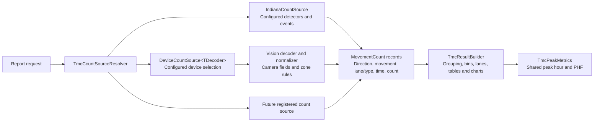
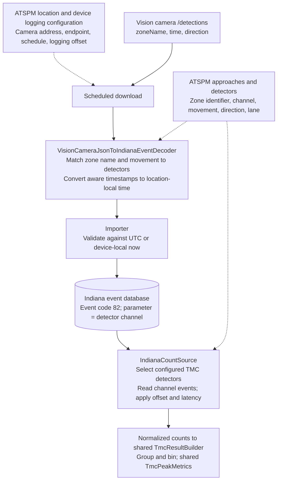
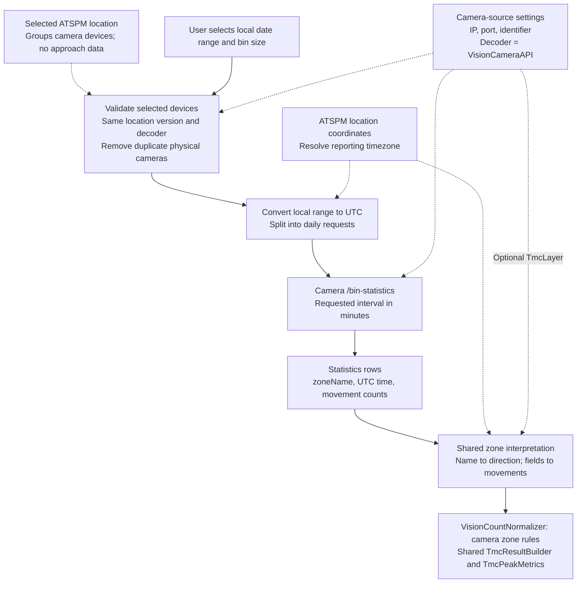
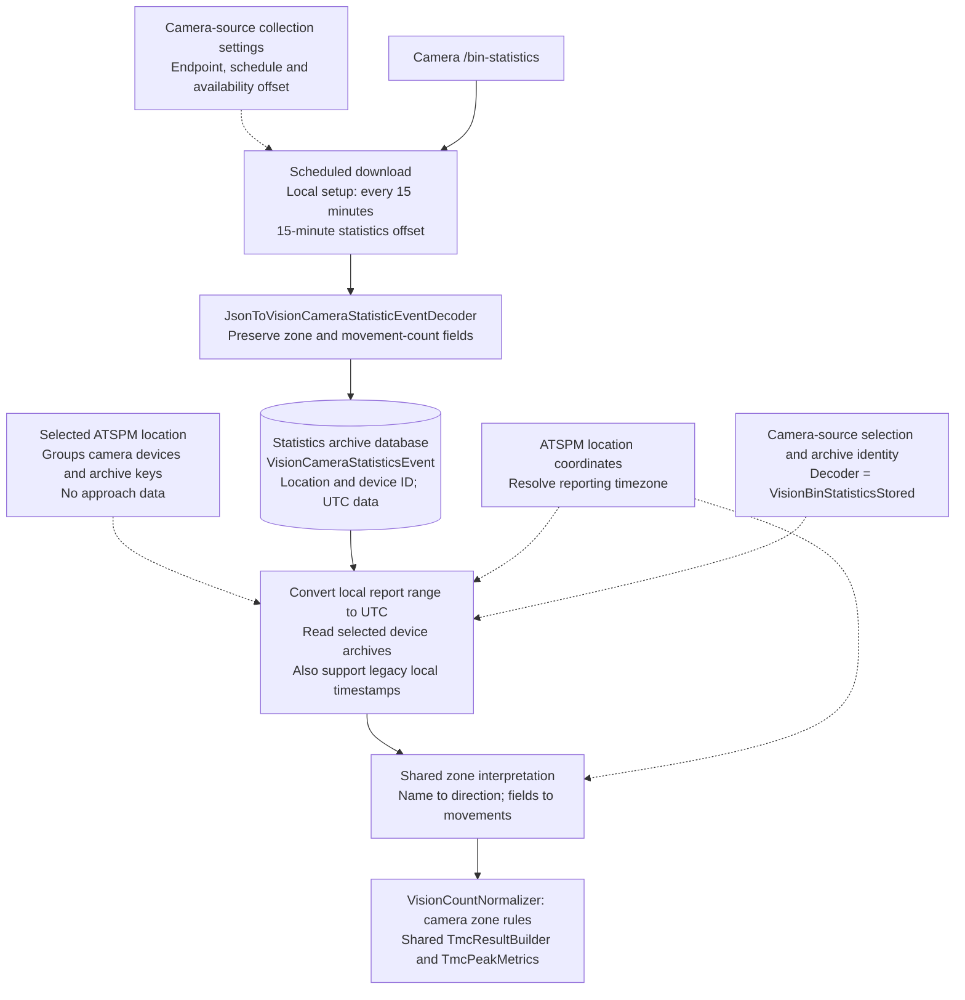
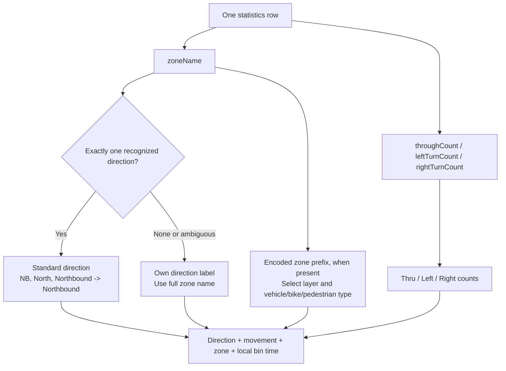

# Turning movement counts: source data flows and limitations

Updated October 6, 2026. The diagrams describe the implemented configuration boundary: only Indiana events use ATSPM approach/detector configuration for interpreting counts. Camera sources retain location grouping and location-based timezone resolution. Solid arrows carry data; dotted arrows supply configuration.

## What configuration does each source use?

**Indiana Events (ATSPM)** use configured approaches and detectors to interpret counts. **Vision Camera API** and **Vision Bin Statistics Stored** must not use approach/detector data for direction, movement or lane interpretation. They use camera zone names and camera movement-count fields instead.

The selected ATSPM location remains the grouping mechanism for cameras. Camera/device identity, connection settings and archive keys can remain in the existing configuration/storage model. Camera report timezone is derived from the selected location's latitude/longitude. Keep this behavior; no separate camera timezone setting is needed. This distinction does not require replacing the location selector or migrating archive identities.

| Dependency | Indiana Events (ATSPM) | Vision Camera API: target | Vision Bin Statistics Stored: target |
|---|---|---|---|
| Count data read when generating report | Indiana event database | Camera `/bin-statistics` API | Statistics archive database |
| ATSPM location | Required | Groups cameras and identifies the report | Groups cameras and identifies existing archives |
| Timezone | Correct local timestamps from collection | Timezone resolved from location coordinates | Timezone resolved from location coordinates |
| Direction | ATSPM approach direction | Camera zone name | Archived camera zone name |
| Movement and lane interpretation | Configured detector movement/lane | Camera count fields and zone naming rules | Archived count fields and zone naming rules |
| Camera identity/settings | Used during camera collection | Existing location-associated devices and camera connection settings | Existing location-associated device/archive identity |
| Indiana plan events | Used for plan annotations | Not read; Unknown plan annotation | Not read; Unknown plan annotation |
| Logging required before reporting | Yes | No | Yes |
| Camera reachable at report time | No | Yes | No |

**Timezone decision:** retain the current implementation. Both statistics decoders interpret selected dates in the location's timezone, convert the query range to UTC, and convert returned UTC timestamps back to local report time. Legacy stored timestamps without a kind are treated as local. The Vision Indiana decoder converts timezone-aware detections using the device location's coordinates and leaves unspecified timestamps unchanged. Valid coordinates are required for conversion; no logger-timezone fallback is used. The statistics availability offset delays collection and is not a timezone adjustment.

The `TmcDecoder` device property accepts a single class name or a comma-separated list, for example `VisionCameraAPI,VisionBinStatisticsStored`. Spaces, empty entries, and duplicate names are ignored. The source radio buttons group the selected location's active devices by each configured decoder. Each choice sends `source=devices`, `deviceIds`, and the selected `decoder`; the API verifies that decoder is configured on every selected device. Older requests without `decoder` still work when there is exactly one common decoder. Multiple choices use the same device ID without mixing their counts. Logging paths and logging decoders remain separate configuration; this does not combine the detections and statistics download endpoints. Labels add spaces to that name and show the distinct camera count. The WebUI shows the report's source label (beside the table heading, on each chart's info line and as the CSV `Source` column) only while device sources are enabled. There is no Live/Stored mode setting. Indiana is registered as the default `atspm` count source. All sources use the same report builder and peak calculations.

## Shared report pipeline and future sources

`ITurningMovementCountSource` reads normalized counts and returns its label, warnings, optional plans and optional bin origin. The report service resolves one source and calls the shared builder. Source-specific parsing and deduplication stay outside the builder. Indiana supplies the selected start as its bin origin to preserve existing event bin boundaries; camera output starts at the next aligned boundary.

For a new device family, implement `ITurningMovementCountDecoder` in an assembly available to the existing service-discovery mechanism. `AddTmcCountSources()` uses the same `RegisterServicesByInterface` helper as logging decoders, then registers a named source adapter for each discovered implementation. No decoder-list entry is needed; register any additional constructor dependencies through normal dependency injection. The generic device adapter handles selection, identity deduplication and aggregation; the decoder owns device validation, payload interpretation and any source-specific merge rules. Set the existing device property `TmcDecoder` to that class name; the current UI discovers it through the existing Config API.

For a non-device source, implement `ITurningMovementCountSource` and register `AddTmcCountSource<YourSource>("source-key")`. API requests can select that registered key without modifying the report service or peak calculations. A new non-device radio choice still needs UI exposure; non-device registrations are not automatically discovered by the current device-based UI. Sources must return counts in local report time and provide stable lane/contributor identities where needed. Registration does not automatically supply collection, timezone conversion or completeness guarantees.

## 1. Indiana Events (ATSPM)

This diagram shows the Vision-camera collection path used in this test installation. Existing controller Indiana events can enter the same database/report path without the Vision import step.

**How directions and movements are obtained:** During import, `zoneName` must exactly match the detector's `DectectorIdentifier` field (the spelling is the existing model name). The detection's `direction` is a movement value: `Through`, `LeftTurn`, or `RightTurn`. The importer matches that value against the detector's configured movement, then writes a code-82 event for the detector channel. At report time, the approach supplies Northbound/Southbound/etc.; the detector supplies movement, lane number and lane type. The Indiana report does not infer compass direction from the camera zone name.

For example, an `NB-18` / `RightTurn` detection becomes channel 19 in the local setup. Channel 19 is configured as Right on the Northbound approach, so the report counts one Northbound Right vehicle.

**Limitations:**

- An unmatched zone/movement creates no Indiana event. Adding a detector later does not recover discarded detections; raw camera data must still exist for a backfill.
- Every matching detector produces an event. Overlapping detector mappings or shared channels can duplicate or misclassify counts; channel assignments must be coordinated across cameras at the location.
- The report selects detectors eligible for the TMC metric. Stored events with missing/ineligible detector configuration do not automatically appear.
- The Vision Indiana decoder stores local wall time resolved from location coordinates. Other logging decoders retain their existing behavior. Detector offset and latency corrections also affect which interval receives an event.
- Combined detector movements (`TR`, `TL`, `LTR`) can match several camera movement values during import. The current report groups L, TL, T, TR and R; it does not expose a separate LTR group.
- This camera importer does not classify counts using `objectType`; lane/type interpretation depends on detector configuration.
- Counts reflect successfully collected and imported detections. This source does not contact the camera to repair gaps when generating a report.

## 2. Vision Camera API

**Configuration boundary:** the selected location groups cameras. Approaches and detectors do not feed zone interpretation. Timezone comes from location coordinates, as in the deployed code. This source does not read Indiana events for plan annotations.

The report reads the camera's existing statistics; it does not count raw detections itself and does not save these query results to the event database. Scheduled logging is independent.

The camera collection URL comes from the existing `DeviceConfiguration.Path`, with IP and port from the device configuration. Discovery reads that path; statistics requests append `/{DeviceIdentifier}/bin-statistics` and construct UTC start/end and interval parameters. A full per-camera logging path ending in `/detections` or `/bin-statistics` is also supported: its numeric camera segment (or `[Device:DeviceIdentifier]` placeholder) and endpoint are removed to obtain the collection path. Blank paths fail validation; there is no hard-coded API-path fallback. The logging `Query` templates are not used for reporting.

Read-only verification on September 30, 2026: GCP `atspm-clone`, database `ATSPM-Config-V6`, configuration 15 (`Cameras!`) has path `/api/v1/cameras`, port 8080 and 229 devices. Its separate logging query templates select detections and bin statistics. Both templates lack the `=` after `end-time`; this report change neither copies those malformed queries nor modifies the clone configuration.

**Limitations:**

- Requires an active FIR/AI camera device with manufacturer Econolite and a model containing Vision, a valid IP/port, and a numeric camera identifier (an optional `-bins` suffix is removed).
- The application accepts report bins from 1 to 1,440 minutes and up to 31 days per request; the camera must also support the requested interval/range. Application acceptance does not guarantee camera support.
- Depends on camera connectivity, retention and statistics availability. Recently completed bins may not yet be available. The report path does not apply the logger's availability offset automatically.
- Requests have a 30-second timeout and at most four concurrent HTTP requests per configured IP/port. Partial failures can return partial counts with warnings, and the source label then counts only the cameras that responded (`Vision Camera API (3 of 4 cameras)`). If no selected camera responds, the report fails with one line per camera.
- A camera that times out, refuses the connection or has an unknown host name is not asked for its remaining days in that report; a warning lists the skipped dates. Other camera errors (rejected request, rejected login, server error) are warned per day, and the remaining days are still requested. Nothing is remembered between reports.
- When the device configuration has a user name, the report sends it and the password as HTTP Basic credentials, for communications managers with login turned on.
- Query start is aligned down to a camera bin boundary. Output discards bins before the selected start; choose aligned start/end boundaries for fair comparisons.
- A successfully returned empty/partial response cannot establish that traffic was zero. Missing intervals are represented as zeros within an otherwise populated series; completeness is not independently proven.

## 3. Vision Bin Statistics Stored

**Configuration boundary:** location/device archive keys remain in use. Approaches and detectors do not supply direction or movement. Timezone comes from location coordinates; no archive migration or separate timezone setting is required.

There are two different decoders here: the **logging decoder** turns downloaded JSON into stored statistics events; the **TMC decoder** reads those events to build a report. Neither step needs ATSPM detector/approach mapping for the counts.

**Limitations:**

- Only previously imported records are available. Reporting does not contact the camera, fill gaps or trigger a backfill.
- The current report decoder assumes stored statistics are **15-minute bins**. Report bin size must be a multiple of 15 minutes, at most 1,440 minutes; range is limited to 31 days. It cannot reconstruct five-minute or individual-vehicle detail from these bins.
- Polling interval and source bin duration are different concepts. Configure collection to obtain 15-minute statistics; polling every 15 minutes alone does not establish the payload's interval. The stored event model has no interval field for the report to verify.
- Statistics can arrive late. The local logger uses a 15-minute offset to query older data; delayed availability or missed polling can still leave gaps. Compare historical, fully collected periods.
- Current validation requires the device to remain active, logging-enabled and configured with `JsonToVisionCameraStatisticEventDecoder`, even when historical records exist.
- Archive selection uses location and device ID. Recreating a device under a new ID does not automatically associate old archives with it.
- Standard statistics retain UTC timestamps. Legacy unspecified-kind timestamps are treated as local wall time; incorrect historical timestamp conventions can shift a report.
- Missing intervals can appear as zeros, as with the API source. An archive record or matching daily total alone is not proof of complete collection.

## Shared interpretation for both Vision statistics sources

| Camera zone name | Direction used |
|---|---|
| `NB-18`, `nb2`, `North`, `northbound-18`, `North Bound Lane 2` | Northbound |
| `EB-2`, `eastbound`; `WB-3`, `West`; `SB-36`, `southbound` | Eastbound; Westbound; Southbound |
| `NE`, `NEB`, `North-East Bound-1` | Northeast |
| `Loading Dock`, `Northgate`, `Westwood` | Each complete name becomes its own direction |
| `NB / SB` | Ambiguous: the complete name becomes its own direction |
| Empty name | `Unnamed zone <zoneId>` |

Matching is case-insensitive and uses whole direction tokens, with separators and numbers allowed. It recognizes cardinal and diagonal forms. Encoded names such as `N21-1` also resolve to Northbound through the N/S/E/W prefix fallback. There is no editable zone-to-direction mapping field; legacy `TmcZoneMap` is ignored. Camera display names and controller phase numbers do not supply compass direction.

Movement is independent of direction: a row named `NB-18` with `throughCount=5`, `leftTurnCount=2`, `rightTurnCount=1` yields Northbound Thru 5, Left 2 and Right 1. The general `volume` field is not substituted for missing movement counts. The software cannot infer left/right/through from an arbitrary zone label or from camera imagery; the camera must provide those counts correctly.

For recognized encoded prefixes, P means pedestrian and B means bicycle; other rows default to vehicle. Pedestrian count is `leftToRightCount + rightToLeftCount`, represented as Thru. An unrecognized name containing the word pedestrian is not sufficient to classify a pedestrian zone.

The optional `TmcLayer` chooses `StopBar` (default), `Advance`, or `RedLightRunning`. Recognized A/RR prefixes identify the latter layers. Other layers are excluded with warnings; pedestrian rows are retained. For encoded advance zones with a parsed setback, the mapper/report select the nearest represented setback. This is a naming-based filter, not a measurement of camera geometry. Chart series use numbered lane labels (Lane 1, Lane 2, etc.). Zone names remain internal to direction interpretation and deduplication; suffix numbers do not become configured physical lane numbers.

## Multiple cameras and comparison pitfalls

Four distinct cameras with the same TMC decoder can be queried together and their accepted zone counts combined by direction/movement. The two decoder types remain separate source choices; they are not added to each other.

- Duplicate physical-camera configuration is collapsed before reading counts. API identity discovery can resolve numeric index/serial aliases; stored selection uses configured IP/port/identifier without contacting hardware.
- Across cameras, duplicate zone keys are assigned to the lowest device ID, with a warning. Ordinary names use the full name, case-insensitively. **Encoded names such as `N21-1` and `N21-2` share key `N21`**, so changing only their suffix does not make them distinct. This refines the earlier shorthand explanation about duplicate names.
- This deduplication assumes matching keys describe the same zone. Independent zones with the same key may be undercounted; overlapping physical zones with different keys may be double-counted. No spatial overlap detection occurs.
- Within one camera response/archive read, repeated rows for the same exact zone name and timestamp keep the last row.
- Camera direction/movement interpretation is shared between API and stored sources, so matching results do not independently validate camera alignment or detection accuracy. Verify camera zone geometry and movement classification separately in the camera tooling.
- **Combine Thru and Thru-Right:** both report paths combine T and TR while retaining dedicated Right counts separately. The camera statistics mapper emits separate T/L/R counts, so it does not fold standalone Right counts into Thru.
- Use the same physical-site timezone, aligned start/end, camera coverage and bin size across the three sources. Use accurate location coordinates for both statistics sources and the Vision Indiana decoder. The tested Utah deployment uses America/Denver; an Arizona installation needs accurate Arizona location coordinates (typically America/Phoenix). A local calendar day does not always equal the same UTC window or exactly 24 hours.
- Tables contain vehicles per interval. Chart lane/flow series are scaled to vehicles per hour; a 15-minute count of 5 corresponds to a flow rate of 20. Compare count fields to count fields.
- Sources own optional plan annotations. Indiana supplies controller plans; both camera sources use Unknown plan and do not read Indiana events.

## Code references

- [Indiana import decoder](../../Atspm/Infrastructure/Services/EventLogDecoders/VisionCameraJsonToIndianaEventDecoder.cs)
- [Shared report service](../../Atspm/ReportApi/ReportServices/TurningMovementCountReportService.cs)
- [Count-source contract](../../Atspm/Application/Business/TurningMovementCounts/ITurningMovementCountSource.cs)
- [Indiana count source](../../Atspm/Infrastructure/Services/TurningMovementCounts/Sources/IndianaCountSource.cs)
- [Generic device adapter](../../Atspm/Infrastructure/Services/TurningMovementCounts/Sources/DeviceCountSource.cs)
- [Camera API decoder](../../Atspm/Infrastructure/Services/TurningMovementCounts/Decoders/EconoliteVision/VisionCameraAPI.cs)
- [Stored statistics decoder](../../Atspm/Infrastructure/Services/TurningMovementCounts/Decoders/EconoliteVision/VisionBinStatisticsStored.cs)
- [Statistics JSON decoder](../../Atspm/Infrastructure/Services/EventLogDecoders/JsonToVisionCameraStatisticEventDecoder.cs)
- [Shared zone interpretation](../../Atspm/Infrastructure/Services/TurningMovementCounts/Decoders/EconoliteVision/VisionZoneMapper.cs)
- [Source selection and validation](../../Atspm/ReportApi/ReportServices/TmcCountSourceResolver.cs)
- [Vision zone deduplication](../../Atspm/Infrastructure/Services/TurningMovementCounts/Decoders/EconoliteVision/VisionCountNormalizer.cs)
- [Shared aggregation](../../Atspm/Application/Business/TurningMovementCounts/TmcResultBuilder.cs)
- [Shared peak metrics](../../Atspm/Application/Business/TurningMovementCounts/TmcPeakMetrics.cs)
- [Source grouping and labels](../../Atspm/WebUI/src/features/charts/turningMovementCounts/useTmcSources.ts)

## Import date validation

The importer compares timezone-aware timestamps against UTC now without changing their stored values. Unspecified Indiana timestamps are compared against current time in the device location's timezone, matching the Vision decoder's conversion. Location timezone is resolved lazily once per import. Legacy Indiana configurations without usable coordinates retain the previous logger-local validation assumption; Vision UTC conversion still requires valid coordinates. Other unspecified event types keep logger-local validation. The configured earliest-date cutoff remains unchanged.

Conversion belongs to the Vision Indiana decoder; the shared importer only validates dates. Tests cover recent and future records with differing logger/device timezones, Utah daylight saving time, Arizona, unchanged UTC statistics, and the legacy no-coordinate fallback.

## Implementation status

Both statistics sources already derive directions/movements without ATSPM approaches or detectors. Retain location-associated camera selection, location/device archive keys, and timezone resolution from location coordinates. No separate camera timezone change is planned.

The diagrams document the implemented shared pipeline. All sources now use the same report assembly and peak metrics; only Indiana uses approach/detector configuration to interpret counts. All report sources validate a positive range of up to 31 days and a bin size from 1 to 1,440 minutes, with additional source-specific constraints described above.

Source discovery reuses device properties already loaded by the frontend, or the existing Config API active-devices-by-location endpoint. The frontend enables camera-only TMC from that data. No TMC-specific Config API endpoints, search modifications, or device-editor changes are needed.
